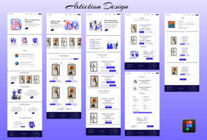
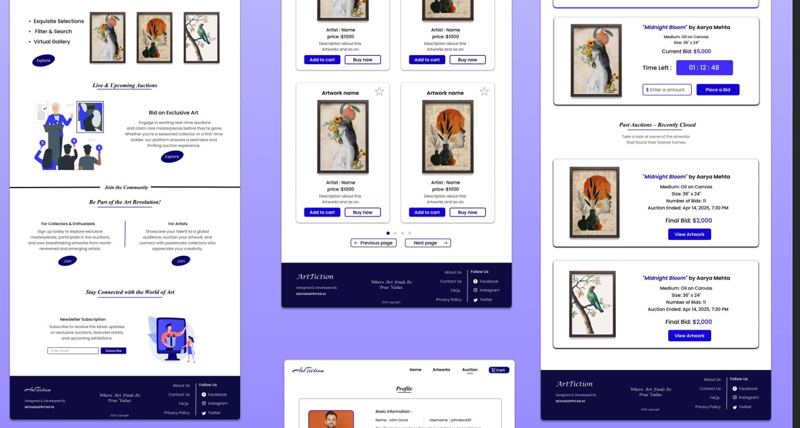

# 🎨 Artiction – Where Art Meets Auction

## Visit our Artiction 🎨 :  [https://artiction.netlify.app](https://artiction.netlify.app/)

**Artiction** is a full-stack web platform that bridges the gap between creativity and commerce. Designed for artists, collectors, and enthusiasts, it transforms traditional art galleries into dynamic digital spaces.

## 🌟 Key Features
- 🧑‍🎨 **Artist Dashboard** – Upload, manage, and showcase your masterpieces.
- 🖼️ **Art Gallery** – Explore a curated collection of artworks from diverse creators.
- 🔨 **Live Auctions** – Engage in real-time bidding and own the art you love.
- 🔐 **User Authentication** – Secure login/signup for artists and buyers.
- 📊 **Admin Panel** – Manage users, artworks, and auctions seamlessly.
- 🧩 **Smart Search & Filters** – Find the right art by artist, style, or price.
- 🔁 **Pagination & Sorting** – Smooth browsing experience for all users.

## 🛠️ Tech Stack
- **Frontend:** HTML, CSS, JavaScript *(optionally with React/Thymeleaf)*
- **Backend:** Spring Boot (REST APIs)
- **Database:** MySQL

## 🚀 Vision
Artiction is more than a gallery—it's a digital stage for artists and a vibrant marketplace for collectors. It empowers creativity, ensures fair bidding, and opens doors for global artistic exchange.

## 🎨 Design

## 💻 Preview

## 🖥️ Video Explaination
[Video Link](https://www.linkedin.com/posts/mohanapriyan-m2006_java-springboot-reactjs-activity-7321169284607492096-5HEY?utm_source=share&utm_medium=member_desktop&rcm=ACoAAEdfjWABL_2j98un4JlBtZDRvHOOIBs2IsE)

_click and watch video_

---

> *Artiction: Because every piece of art deserves its spotlight—and a bidding war!*
