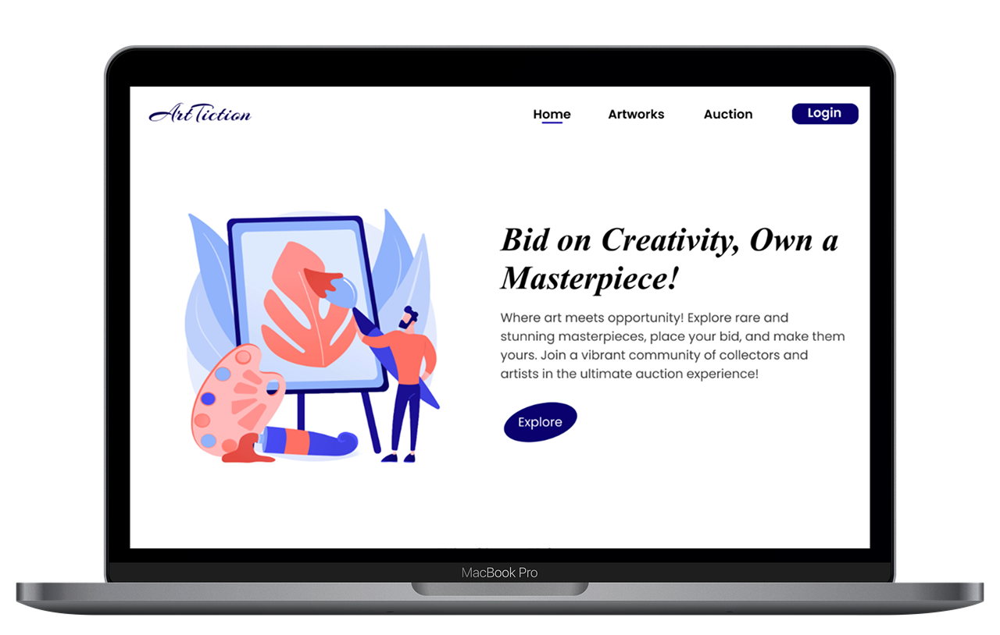

<div align="center">

# 🎨 Artiction
### *Where Every Brushstroke Tells a Story, Every Bid Writes History*

[](https://artiction.netlify.app)
[](https://reactjs.org/)
[](https://spring.io/projects/spring-boot)
[](https://mysql.com/)

### [](https://artiction.netlify.app/)

</div>

---

## 🌟 Imagine a World Where Art Lives, Breathes, and Finds Its Home

Picture this: You're an artist who just finished your masterpiece at 2 AM, paint still wet under your fingernails. Where do you take it? How do you find the person who will love it as much as you do? 

Or maybe you're a collector, scrolling endlessly through generic marketplaces, wondering if that perfect piece even exists—the one that will make your heart skip a beat every time you walk past it.

**Welcome to Artiction.** 

This isn't just another auction platform. It's where dreams meet canvas, where artists find their audience, and where collectors discover pieces that speak to their soul. Built by art lovers, for art lovers, Artiction transforms the cold, impersonal world of online art trading into a warm, vibrant community where every transaction tells a story.

## ✨ Why Artists & Collectors Choose Artiction

### 🧑‍🎨 **For Artists: Your Creative Journey, Amplified**
- **Your Personal Gallery**: Upload your art in minutes, not months. No complex processes, no waiting for approval from gatekeepers
- **Tell Your Story**: Every piece comes with space for your narrative—because art without context is just decoration
- **Fair Revenue**: Keep more of what you earn. No hidden fees eating into your creative livelihood
- **Global Reach**: From your studio to collectors worldwide—geography is no longer a barrier

### 🎭 **For Collectors: Discover, Connect, Own**
- **Live Auction Thrills**: Feel your heart race as you bid in real-time. Every auction is an event, every win a victory
- **Smart Discovery**: Our AI understands your taste better than you do. Find pieces that resonate before you even know you're looking
- **Authentic Connections**: Chat with artists, understand their process, own pieces with provenance and passion
- **Secure Transactions**: Bid with confidence. Your payments are protected, your art is authenticated

### 🏛️ **For Everyone: A Community That Cares**
- **Inclusive Marketplace**: Whether you're spending $50 or $5,000, every art lover belongs here
- **Educational Hub**: Learn about techniques, styles, and stories behind the art
- **Supporting Emerging Talent**: Every purchase directly supports an artist's journey

## 🚀 Built With Love & Modern Technology

We believe great art deserves great technology. Artiction is crafted with cutting-edge tools that ensure lightning-fast performance, bulletproof security, and an experience smoother than silk.

### **Frontend Magic** ✨
- **React 19.0** - The latest and greatest for fluid, responsive interfaces
- **Vite** - Because waiting for builds kills creativity
- **Tailwind CSS** - Pixel-perfect design that adapts to every screen
- **Framer Motion** - Animations that bring art to life
- **Axios** - Reliable data fetching that never lets you down

### **Backend Powerhouse** ⚡
- **Spring Boot 3.x** - Enterprise-grade reliability meets startup agility
- **RESTful APIs** - Clean, predictable communication
- **MySQL 8.0** - Your data, safe and lightning-fast
- **JWT Authentication** - Bank-level security for peace of mind

### **DevOps & Deployment** 🛠️
- **Netlify** - Global CDN for instant loading worldwide
- **Git Workflows** - Collaborative development that just works
- **ESLint** - Code so clean you could eat off it

## 🎯 Our Vision: Democratizing Art, One Auction at a Time

**The Problem**: Traditional art markets are exclusive, intimidating, and often gatekept by institutions that decide who gets to participate. Emerging artists struggle to find their audience, while art lovers feel overwhelmed or priced out.

**Our Solution**: Artiction breaks down these barriers. We're creating a world where:
- 🌍 **Geography doesn't limit opportunity** - A painter in rural India can sell to a collector in New York
- 💰 **Budget doesn't determine access** - Beautiful art exists at every price point
- 🤝 **Technology serves humanity** - Our platform connects people, not just transactions
- 🎨 **Every artist has a voice** - No more waiting for gallery approval or exhibition slots

**The Impact**: Since our launch, we've helped hundreds of artists find their collectors, facilitated thousands of meaningful connections, and proved that when you remove barriers, art flourishes.

> *"Artiction didn't just help me sell my art—it helped me find my community. For the first time, I felt like my voice mattered in the art world."*  
> — Sarah Chen, Digital Artist from Vancouver

## 🚀 Quick Start: Join the Revolution in 5 Minutes

### **For Artists Ready to Showcase**
```bash
# Visit artiction.netlify.app
# Click "Join as Artist"
# Upload your first piece
# Watch the magic happen
```

### **For Developers Who Want to Contribute**
```bash
# Clone the repository
git clone https://github.com/mohanapriyan2006/Artiction.git
cd Artiction

# Frontend setup
cd frontend/artiction
npm install
npm run dev

# Backend setup (separate terminal)
cd backend/artiction
./mvnw spring-boot:run

# Open http://localhost:3000 and start creating!
```

### **System Requirements**
- Node.js 18+ (for that modern JavaScript goodness)
- Java 17+ (for enterprise-grade backend stability)
- MySQL 8.0+ (for data that scales with your dreams)
- 4GB RAM (because great art needs breathing room)

## 📸 See Artiction in Action

*Because a picture is worth a thousand words, but a great UI is worth a thousand pictures.*

<div align="center">

### 🏠 **Home Sweet Home**
*Where first impressions become lasting connections*


### 🎨 **Artist's Canvas**
*Your creative control center*


### 🎬 **The Full Experience**
*Watch Artiction come alive*


</div>

---

## 🎥 Behind the Scenes: Meet the Creators

Curious about the story behind Artiction? Watch our founder explain the passion, the problems we're solving, and the future we're building:

### [🚀 **Watch Our Story**](https://www.linkedin.com/posts/mohanapriyan-m2006_java-springboot-reactjs-activity-7321169284607492096-5HEY?utm_source=share&utm_medium=member_desktop&rcm=ACoAAEdfjWABL_2j98un4JlBtZDRvHOOIBs2IsE)
*3-minute journey from concept to community*


## 🙏 Acknowledgments & Love

**To Our Amazing Contributors:**
Every line of code, every design pixel, every bug report makes Artiction better. You're not just contributors—you're co-creators of the future of art.

**To Our Early Adopters:**
Your trust in our vision, your feedback, and your willingness to try something new built the foundation of what Artiction is today.

**To Artists Everywhere:**
Keep creating. The world needs your vision, your passion, and your unique voice. Artiction exists to amplify that voice.

---

<div align="center">

### 💝 Love What We're Building?

**⭐ Star this repository** to show your support  
**🐦 [Follow us on social media](#)** for updates  
**💌 [Join our newsletter](#)** for artist spotlights  
**💬 [Join our Discord community](#)** for real-time discussions

---

### *"In a world of copies, be the original. In a world of silence, be the voice. In a world of art, be Artiction."*

**[🎨 Start Your Journey Today →](https://artiction.netlify.app)**

</div>
